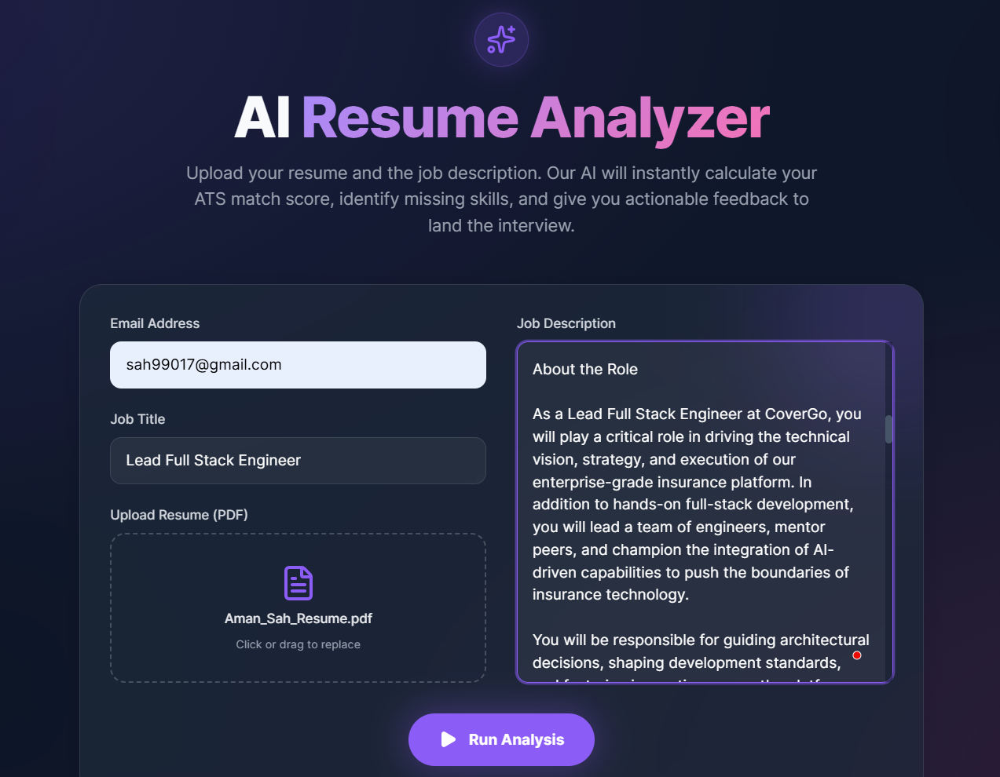
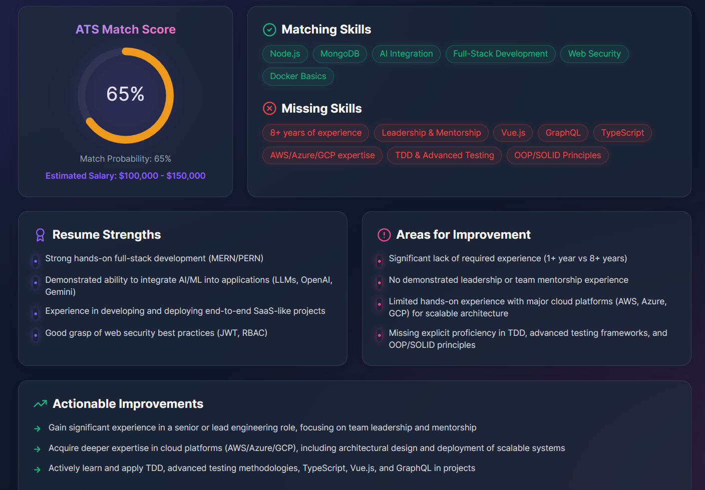
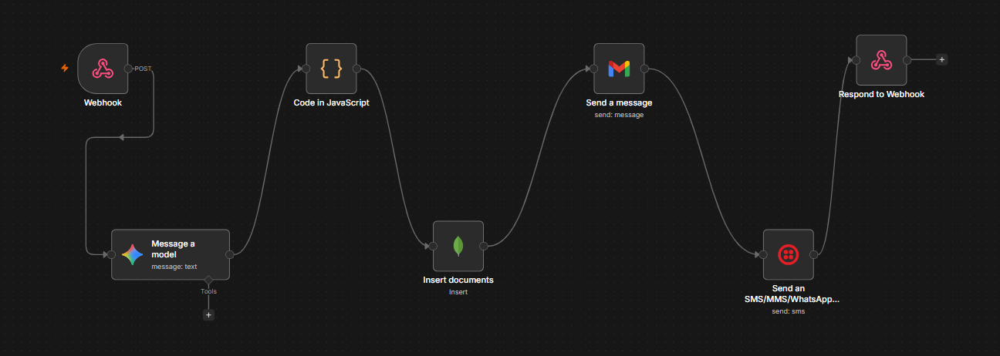

# AI Resume Analyzer 🚀

An incredibly powerful, state-of-the-art Web Application that automatically analyzes candidate resumes (PDFs) against job descriptions using Google's Gemini AI, and instantly notifies the candidate via Email and WhatsApp regarding their Match Score and feedback.

The backend infrastructure is 100% powered by an automated **n8n** visual workflow, making it incredibly easy to manage, debug, and scale without writing complex server-side Node.js code.

---

## 📸 Project Screenshots

### React User Interface


### Comprehensive ATS Results Dashboard


### Automated n8n Backend Architecture


---

## ✨ Key Features

### 🎨 Premium User Interface
- Built with **React**, **Tailwind CSS**, and **Framer Motion**. 
- Features a glowing glassmorphic aesthetic, floating animated background orbs, magnetic hover interactions, and satisfying staggered entrance animations for all analytical data.
- fully responsive design that works beautifully on mobile and desktop.

### 🧠 Client-Side PDF Parsing
- Securely extracts text from PDF resumes directly in the browser using Mozilla's `pdfjs-dist`. 
- By parsing locally, the app saves massive amounts of backend bandwidth, improves processing speed, and protects user privacy by only transmitting raw text rather than the actual PDF file over the internet.

### 🤖 AI-Powered ATS Engine
- Utilizes Google's `gemini-2.0-flash` model to perform high-speed, deep-context analysis.
- Calculates an overall ATS Match Percentage.
- Identifies exact matching skills and critically missing skills.
- Deduces resume strengths and areas for improvement.
- Generates custom, targeted interview questions based strictly on the candidate's weak points relative to the job description.

### 📡 Multi-Channel Notifications
- **Email:** Automatically emails the candidate a detailed report via the Gmail API.
- **WhatsApp/SMS:** Sends a rapid-fire alert to the user's phone via the Twilio API the moment the analysis finishes.

### ☁️ Serverless-Ready Architecture
- Pre-configured with dynamic proxies (`vite.config.js`) for local development.
- Includes `vercel.json` routing rules to seamlessly bypass strict CORS policies when deployed to production.

---

## 🛠️ Technology Stack
- **Frontend Framework:** React 19 + Vite
- **Styling:** Tailwind CSS v4 + Vanilla CSS
- **Animations:** Framer Motion
- **PDF Extraction:** PDF.js (`pdfjs-dist`)
- **HTTP Client:** Axios
- **Backend / Orchestration:** n8n Cloud
- **Database:** MongoDB
- **AI Engine:** Google Gemini API
- **Communication APIs:** Gmail API, Twilio API

---

## 🏗️ Architecture Flow

1. User uploads a PDF and pastes a Job Description on the React website.
2. The React app extracts the raw text from the PDF locally via `pdfjs-dist`.
3. React packages the data into a JSON payload (`email`, `jobTitle`, `jobDescription`, `resumeText`) and sends it to an **n8n Webhook**.
4. The n8n workflow receives the payload and passes the data into the **Gemini AI Node**. The prompt strictly instructs the AI to act as a senior HR recruiter and output only pure JSON.
5. A custom **JavaScript Code Node** intercepts the AI's response, cleans any markdown formatting, and ensures it is perfectly parsed JSON.
6. The n8n workflow branches out:
   - Triggers the **MongoDB Node** (`Insert documents`) to save the candidate's analysis data to your database permanently.
   - Triggers the **Gmail Node** to email the candidate.
   - Triggers the **Twilio Node** to WhatsApp the candidate.
7. Finally, the **Respond to Webhook Node** fires, sending the structured JSON analysis back to the awaiting React app.
8. The React app unmounts the loading spinner and triggers a beautiful staggered animation sequence to display the results!

---

## 💻 Local Setup & Installation

### Prerequisites
- **Node.js** (v18 or higher)
- **n8n Account** (Cloud or self-hosted)
- **Google Gemini API Key** (Free tier works perfectly)
- **Twilio Account** (For WhatsApp/SMS Sandbox)

### 1. Frontend Setup
1. Clone the repository, open a terminal, and navigate to the `frontend` folder:
   ```bash
   cd frontend
   ```
2. Install all Node dependencies:
   ```bash
   npm install
   ```
3. Create a `.env` file in the root of the `frontend` folder. Add your n8n test webhook URL:
   ```env
   VITE_WEBHOOK_URL="https://YOUR_N8N_DOMAIN.app.n8n.cloud/webhook-test/analyze"
   ```
4. Start the local Vite development server:
   ```bash
   npm run dev
   ```

### 2. n8n Backend Setup
1. Create a new workflow in n8n.
2. Set up the following nodes in order:
   - **Webhook Node**: Set Method to `POST`. Set Respond to `Using 'Respond to Webhook' Node`.
   - **Google Gemini Node**: Action `Message a Model`. Model `models/gemini-2.0-flash`. Pass in the incoming webhook data into the Prompt box.
   - **Code Node (JavaScript)**: Paste the following parsing logic to clean the AI data:
     ```javascript
     let geminiResponse;
     let rawData = $input.first().json;
     let extractedText = "";

     if (rawData.content && rawData.content.parts && rawData.content.parts.length > 0) {
       extractedText = rawData.content.parts[0].text;
     } else if (rawData.text) {
       extractedText = rawData.text;
     } else {
       extractedText = rawData;
     }

     if (typeof extractedText === 'string') {
       let cleanText = extractedText.replace(/```json/g, '').replace(/```/g, '').trim();
       geminiResponse = JSON.parse(cleanText);
     } else {
       geminiResponse = extractedText;
     }

     const incomingData = $node["Webhook"].json.body;

     return {
       json: {
         candidateEmail: incomingData.email,
         jobTitle: incomingData.jobTitle,
         analysis: geminiResponse,
         timestamp: new Date().toISOString()
       }
     };
     ```
   - **MongoDB Node**: Action `Insert`. Connect to your MongoDB instance and save `$json` to a collection (e.g., `candidates`).
   - **Gmail Node**: Action `Send an Email`. Set "To" as `{{$json.candidateEmail}}`. *(Pro-tip: Under "Additional Fields", add a "Sender Name" like "AI Recruitment Team")*.
   - **Twilio Node**: Action `Send a WhatsApp Message`. Connect to your Twilio Sandbox.
   - **Respond to Webhook Node**: Set Respond With to `JSON`. Pass in the output of the Code Node.
3. Save the workflow and click **Listen for test event**.

---

## 🐛 Troubleshooting Common Errors

### `429 Too Many Requests` (Gemini API)
**Symptom:** Your n8n workflow crashes at the "Message a Model" node with "The service is receiving too many requests from you."
**Fix:** Google's Free Tier has a limit of 15 requests per minute. Simply wait 60 seconds and try again. *Recommendation: Enable "Retry On Fail" in the n8n Gemini node settings (Max Tries: 3, Wait: 5000ms).*

### `500 Internal Server Error`
**Symptom:** The React website shows a red error banner saying the n8n workflow crashed.
**Fix:** Open the n8n dashboard and go to the **Executions** tab. Click the top failed run. One node on your canvas will be glowing red, explaining exactly why the workflow failed (usually the Gemini rate limit or a Twilio sandbox error).

### `404 Not Found`
**Symptom:** The React website throws a 404 error when clicking "Run Analysis".
**Fix:** If you are using the Production Webhook URL (`/webhook/`), you **MUST** ensure the toggle switch in the top right corner of your n8n workflow is set to **Active**. If it is Inactive, the production URL shuts down.

---

## 🚀 Deployment (Vercel)

If you want to host this application live on the internet, it is specifically pre-configured to deploy seamlessly to Vercel without tricky CORS backend setups!

1. In n8n, toggle your workflow to **Active**. (This activates the Production `/webhook/` URL which runs 24/7).
2. Push your `frontend` code to a GitHub repository.
3. Log into Vercel and import your new GitHub repository.
4. Add your Environment Variable in the Vercel dashboard configuration:
   - **Key:** `VITE_WEBHOOK_URL`
   - **Value:** `https://YOUR_N8N_DOMAIN.app.n8n.cloud/webhook/analyze`
   *(Important: Notice that we removed `-test` from the URL!)*
5. Click **Deploy**. 

Vercel will automatically read the included `vercel.json` file and route all your frontend webhook requests through a secure server-side proxy, completely bypassing any browser CORS blocks!
